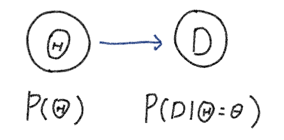

# ベイズ学習の枠組み

## ■ ベイズ学習は確率分布を学習する
　ベイズ学習は、「事象（データ）$\mathcal{D}$が観測された」という条件のもとでの未知の変数$\mathbf{w}$の確率分布、すなわち事後確率分布$p(\mathbf{w}|\mathcal{D})$を推論する作業になります。一般的にベイズ学習は以下の２つのStepで行っていくといえます。
1. **確率モデル（生成モデル）の構築**：対象とする事象がどのような確率過程を経て生成されたのかをモデル化する。
2. **推論**：確率モデルと観測されたデータをもとに事後確率を求める。

それぞれのステップについて少し詳しく見ていきましょう。
### ▼ Step1：確率モデル（生成モデル）の構築
　まず、着目する事象が確率的なプロセスから発生するものだという仮定を置き、そのプロセスをモデル化することから始めます。確率的な事象を確率変数によって定義し、確率変数の組み合わせで事象を表現していきます。このようなモデルを**生成モデル**と呼びます。また事象の確率プロセスがモデル化できるとそれはすなわち確率変数間の同時確率分布を定式化することになります。
#### 例：赤玉白玉問題
　赤玉と白玉が入っている袋があり、そこに入っている赤玉と白玉の数の割合$\Theta$は未知とします。そこでこの袋から無作為に玉を取り出した結果$\mathcal{D}$をもとに$\Theta$を推測したいという課題を考えます。

　この時ベイズ学習では$\Theta$自体を確率変数と考え、観測データ$\mathcal{D}$が得られた時の事後確率分布$p(\Theta | \mathcal{D})$を推論することになりますが、袋から取り出した時の色が決まる過程はどのようにモデル化できるでしょうか？

　この問題の場合、下図のように①玉の割合は確率分布$p(\Theta)$に従って確率的に決まり②$\Theta$の実現値$\theta$に準じて取り出す玉の色が確率的に決まるというようにモデル化することになります。

また同時確率は同時確率と条件付き確率の定義から
$$
p(\mathcal{D}, \Theta)=p(\mathcal{D}| \Theta)p(\Theta)
$$
と書けることがわかります。

### ▼ Step2：推論
Step1で確率モデルが構築できたら、そのモデルと観測データから未知のパラメータの確率分布を推論します。これはすなわち冒頭での話のとおり、観測データ$\mathcal{D}$を得た条件下で未知のパラメータがとる条件付き確率$P(\mathbf{w}|\mathcal{D})$を推論することに相当します。
ではこの$P(\mathbf{w}|\mathcal{D})$はどう計算すれば良いのかを考えていきましょう。条件付き確率の定義から
$$P(\mathbf{w}|\mathcal{D})=\frac{P(\mathbf{w},\mathcal{D})}{P(\mathcal{D})}=\frac{P(\mathbf{w},\mathcal{D})}{\sum_{\mathbf{w}} P(\mathbf{w},\mathcal{D})}$$
と書き換えられます。
分子の同時確率はStep1の確率モデルの構築ができた時点で定式化されており求めることができるし、分母は未知のパラメータの取りえる値全てに関して同時確率を足し合わす（周辺化する）ことで求められます。

つまりこの式は、どのような確率モデルの例であっても、同時確率とその未知のパラメータに対する周辺分布を計算することで事後分布$P(W|D)$を推論可能であるということを示していることになります。

実際の複雑な確率モデルを扱う場合、周辺確率を求めるのに非常にコストがかかるためサンプリングや変分法と呼ばれる近似手法によって事後分布を計算するケースが多いですが、**おおもとのベイズ学習の発想は「同時確率とその未知のパラメータに対する周辺分布から事後分布を計算する」ということにある**ことは覚えておいた方が良いでしょう。

## ■ 推論の具体例
ここでは手で計算できるレベルの非常に単純なモデルを例に、実際に同時確率とその周辺確率から実際にベイズ推論を行ってみたいと思います。

**例：箱の中のボールの数の推論**

ある箱の中にボールが３つ入っている。ボールの色は赤か白のどちらかだが、どの色が何個入っているかはわからない。ここで箱の中からランダムに１つボールを取り出しそのボールの色を確認後箱の中に戻すという操作を行う。
【ケースA】１回の試行で「白」が出た場合
【ケースB】３回の試行で「白→赤→白」が出た場合
の２つの場合で箱の中の白ボールの数がどのように推論できるかを見ていこう。

### 【ケースA】１回の試行で「白」が出た場合

上のように、確率モデルの構築→推論とステップを踏んで進めていこう。
#### 確率モデルの構築
この場合の事象は下図のようなグラフィカルモデルで表せる。ここで$W=\{0, 1, 2, 3\}$は白玉の数を示す確率変数で、$W$の値により試行時に取り出される玉の色$X=\{r, w\}$の確率が決まるというモデルになっている。



また、簡単な確率の考察からそれぞれの確率は下表のようになる。ここで箱の中の玉の数は何の情報もないため等確率で発生するものとして$P_0(W)=1/4$、ここで$W=\{0,1, 2, 3\}$としている。この$P_0(W)$を事前確率という。



#### 推論

「１回の試行で白ボールを取り出した」というデータが確定したもとでの白ボールの数を推論したいので、求めたいのは事後確率$P(W|X_1=w)$であり、条件付き確率の定義から
$$P(W|X_1=w)=\frac{P(W,X_1=w)}{P(X_1=w)}=\frac{P(W,X_1=w)}{\sum_W{P(W, X_1=w)}}\tag{1}$$
と書ける。上記の最左辺の分子と分母はこれまでの情報で計算できることがわかると思う。それぞれ求めていってみよう。
分子の同時確率は$P(W, X_1)=P(X_1|W)P(W)$であり、$P(W)_0=P(W)$とすると、
上の表から以下のように計算できる。
$$\begin{cases}P(W=0, X_1=w) &= P(X_1=w|W=0)P_0(W=0)= 0 \cdot \frac{1}{4} = 0 \\\ P(W=1, X_1=w) &= P(X_1=w|W=1)P_0(W=1)= \frac{1}{3} \cdot \frac{1}{4} = \frac{1}{12} \\\ P(W=2, X_1=w) &= P(X_1=w|W=2)P_0(W=2)= \frac{2}{3} \cdot \frac{1}{4} = \frac{1}{6} \\\ P(W=3, X_1=w) &= P(X_1=w|W=3)P_0(W=3)= 1 \cdot \frac{1}{4} = \frac{1}{4} \end{cases}$$

また(1)式の分母である周辺確率は
$$P(X_1=w)=\sum_{W}P(W, X_1=w) = 0+ \frac{1}{12} + \frac{1}{6} + \frac{1}{4} = \frac{1}{2}$$
となり、同様に$P(X_1=w)=\frac{1}{2}$となる。

(1)式にこれらの結果を代入すると
$$\begin{cases}P(W=0|X_1=w) &= 0 / \frac{1}{2} = 0\\\ P(W=1|X_1=w) &= \frac{1}{12} / \frac{1}{2} =\frac{1}{6}\\\ P(W=2|X_1=w) &= \frac{1}{6} / \frac{1}{2} =\frac{1}{3}\\\ P(W=3|X_1=w) &= \frac{1}{4} / \frac{1}{2} =\frac{1}{2}\\\ \end{cases}$$
となり、１回目に白ボールが出た場合、確率的には箱の中のボールは全部白の可能性が一番高いと推論できることを示している。

### 【ケースB】３回の試行で「白→赤→白」が出た場合
ケースAと同様の考察を繰り返すと良いです。
要点は、ボールを試行の度に箱に戻すため、Wが決定された状態では、各試行間は独立なので
$$P(X_1,X_2,X_3)=P(X_1)P(X_2)P(X_3)$$
となることを利用することにあります。ここで実際の計算は練習問題としておきます。
