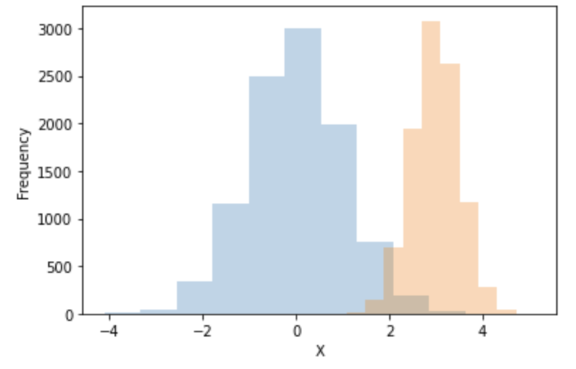

<script type="text/javascript" async src="https://cdnjs.cloudflare.com/ajax/libs/mathjax/2.7.7/MathJax.js?config=TeX-MML-AM_CHTML">
</script>
<script type="text/x-mathjax-config">
 MathJax.Hub.Config({
 tex2jax: {
 inlineMath: [['$', '$'] ],
 displayMath: [ ['$$','$$'], ["\\[","\\]"] ]
 }
 });
</script>

# 確率分布の取り扱い
前節でPyroに用意された正規分布やベルヌーイ分布の関数（`dist.Normal`、`dist.Bernoulli`）を利用しましたが、本節ではもう少し詳しくPyroでの確率分布の取り扱いについて見ていくことにします。

## ■ 実現値のサンプリング
Pyroでの確率分布はPytorchの確率分布関数の薄いラッパークラス[^mixin]として定義されているため、Pytorchの確率分布クラスで定義されている各種機能が利用可能です。そのため確率分布からの実現値は以下のように`sample()`関数を用いてサンプリングします。
```python
normal_1d = dist.Normal(0.0, 1.0)
print(normal_1d.sample())

##Output
# tensor(-0.6117)
```
多次元の確率分布も同様です。例えば２次元の正規分布関数からは２次元のサンプリング値が出力されます。
```python
normal_2d = dist.MultivariateNormal(torch.zeros(2), torch.eye(2))
print(normal_2d.sample())

## Output
# tensor([2.5499, 0.2041])
```
また、`sample`関数に`torch.Size`を引数に渡すことで指定のshapeでサンプリングすることができます。
```python
normal_1d = dist.Normal(0.0, 1.0)
samples = normal_1d.sample(torch.Size([2, 3]))
print(samples)

## Output
tensor([[ 0.7036,  2.2816,  0.5640],
        [ 0.3072, -1.0661, -1.6618]])
```
ここでサンプリングされた値間は**独立同分布（IID）の関係**にあることに注意してください。

前節のように確率モデリングをする場合、後々の推論などで確率変数の名前をつけると扱いやすいです。その場合は`pyro.sample`関数を用いて確率変数に名前をつけた上でサンプリングを行うことが可能です。下の例では変数名"X"と名付けられたベルヌーイ分布の確率変数から実現値をサンプルし、変数`x`に格納する動作になります。
```python
x = pyro.sample('X', dist.Bernoulli(0.5))
print(x)

## Output
# tensor(1.)
```

## ■ 確率（密度）の取得
各確率分布において、指定された値が実現値となる確率を計算するには`log_prob()`関数を利用します。これは対数確率密度を計算するので生の確率密度値を計算する場合はこの出力に対して`np.exp()`を計算します。
```python
bel_dist = dist.Bernoulli(0.6)
x = torch.tensor([1.0, 0.0])
log_prob_x = bel_dist.log_prob(x)
print(np.exp(log_prob_x))

## Output
# tensor([0.6000, 0.4000])
```

## ■ batch_shapeとevent_shape
### ▼ batch_shape
確率分布のパラメータを`Tensor`型で複数与えることで、同種の分布だが異なるパラメータで特徴付けられた複数の分布を同時に定義することが出来ます。例えば下記のコードでは
* 平均: 0.0、標準偏差: 1.0
* 平均: 3.0、標準偏差: 0.5

の２つの分布を１つの確率分布変数として定義していいます。
```python
locs = torch.tensor([0.0, 3.0])
sds = torch.tensor([1.0, 0.5])
normal_1d_cond = dist.Normal(locs, sds)
print("batch_shape =", normal_1d_cond.batch_shape)
```
```bash
## Output
> batch_shape = torch.Size([2])
```
ここで`batch_shape`という属性が出てきました。これは確率分布変数に定義された分布の種類の数を示しており、上記例では二種類のパラメータを指定しているので「2」になります。

また上記コードのように定義された確率分布から`sample()`関数でサンプリングすると、定義に用いられた複数のパラメータでの確率分布の実現値がサンプリングされます。ここで`samples[:, 0]`は平均:0.0、標準偏差1.0、`samples[:, 1]`は平均:3.0、標準偏差0.5の正規分布から、それぞれ独立にサンプリングされた値が格納されることになります。

```python
samples = normal_1d_cond.sample(torch.Size([10000]))
print("samples.shape =", samples.shape)

plt.hist(samples[:, 0], alpha=0.3)
plt.hist(samples[:, 1], alpha=0.3)
plt.xlabel("X")
plt.ylabel("Frequency")
plt.show()
```
```bash
## Output
> samples.shape = torch.Size([10000, 2])
```
<center>

</center>

また以下のように確率密度を求めた場合も、各パラメータでの確率密度が出力されます。最後の行のprint文に示したように**確率密度のshapeは確率分布変数の`batch_shape`と等しい**ことに注意してください。

```python
log_prob_x = normal_1d_cond.log_prob(torch.Tensor([1.0]))
print(np.exp(log_prob_x))
print(log_prob_x.shape == normal_1d_cond.batch_shape)
```
```bash
## Output
> tensor([0.2420, 0.0003])
> True
```

### ▼ event_shape
Pyroの確率分布には`event_shape`という属性が設定されます。この属性は確率分布の従属変数の数（＝サンプルされる実現値の次元数）が格納されます。

具体例として二次元正規分布を考えてみます。この分布から実現値をサンプルすると当然ながら２次元ベクトルが出力され（出力1行目）、`event_shape`属性も同じく`２`となっているのがわかります（出力2行目）。また確率密度は２つの確率変数の値によって定まるため、今回の場合２次元のベクトルを与えて初めて１つの確率密度が求まることがわかります。（出力3行目）。
```python
normal_2d = dist.MultivariateNormal(torch.zeros(2), torch.eye(2))
sampled = normal_2d.sample()
print("(x, y)=", sampled)
print(normal_2d.event_shape)
print("P(x, y) =", np.exp(normal_2d.log_prob(sampled)))
```
```plain
## Output
> (x, y)= tensor([-0.5593,  0.4162])
> torch.Size([2])
> P(x, y) = tensor(0.1248)
```

### ▼ 従属変数化 `to_event()`
Pyroでは`to_event()`関数を用いて、１次元確率分布を組み合わせて多次元確率分布を定義することが可能です。
以下のようにベルヌーイ分布を定義します。2×2の計4つのパラメータの分布を指定してるため`batch_shape`は2×2になります（出力1行目）。当然、確率分布はそれぞれの確率分布で計算されています（出力2行目）。
```python
ps = torch.Tensor([[0.3, 0.8], [0.1, 1.0]])
bern_dist = dist.Bernoulli(ps)
print("bern_dist.batch_shape =", bern_dist.batch_shape)

# 2×2=4つの異なるパラメータの確率分布それぞれのP(X=1)を計算
val = torch.Tensor([1.0])
print("P(X=1) =", np.exp(bern_dist.log_prob(val)))
```
```plain
## Output
> bern_dist.batch_shape = torch.Size([2, 2])
> bern_dist.event_shape = torch.Size([])
> P(x=1) = tensor([[0.3000, 0.8000],
>         [0.1000, 1.0000]])
```
この確率分布変数に対して`to_event()`を適用します。
```python
bern_dist2 = bern_dist.to_event(1)
print("bern_dist2.batch_shape =", bern_dist2.batch_shape)
print("bern_dist2.event_shape =", bern_dist2.event_shape)

val = torch.Tensor([1.0])
print("P(X=1) =", np.exp(bern_dist2.log_prob(val)))
```
```plain
## Output
> bern_dist2.batch_shape = torch.Size([2])
> bern_dist2.event_shape = torch.Size([2])
> P(X=1) = tensor([0.2400, 0.1000])
```
ここで`.to_event(1)`の引数`1`は`batch_shape`の右から１つ目（２つ目の次元）だけを従属化するという指定になります。

つまり今回の場合、
$$
\begin{bmatrix}
P(X) = Bern(X|\mu=0.3) & P(X) = Bern(X|\mu=0.8) \newline
P(X) = Bern(X|\mu=0.1) & P(X) = Bern(X|\mu=1.0) 
\end{bmatrix}
$$
の４つの確率分布を定義しておき、`to_event(1)`により上記の同一行の確率分布をまとめて（従属変数化）
$$
\begin{bmatrix}
P(X, Y) = Bern(X|\mu=0.3) * Bern(Y|\mu=0.8) \newline
P(X, Y) = Bern(X|\mu=0.1) * Bern(Y|\mu=1.0) 
\end{bmatrix}
$$
の２次元の確率分布を２つ定義することを行っていることになります。

## ■ ベイズ学習へ
ここまででPyroを用いて対象の事象に合わせた確率モデル、いわゆる生成モデルを定義することを行ってきました。ベイズ学習ではこの確率モデルに観測されたデータを組み合わせることで、未知のパラメータを学習・推論することになります。例えば、前節の赤玉白玉問題の場合、取り出された玉の色のデータをもとに袋の中の赤玉の数を推定していくことを行います。

Pyroを用いてベイズ学習を実装していく前に、必要最小限のベイズ学習の知識を復習していきましょう。

[^mixin]:つまり[`torch.distributions.distribution.Distribution`クラス](https://pytorch.org/docs/master/distributions.html#torch.distributions.distribution.Distribution)と、[`TorchDistributionMixin`](https://docs.pyro.ai/en/dev/distributions.html#pyro.distributions.torch_distribution.TorchDistributionMixin)の多重継承サブクラスとして実装されています。


