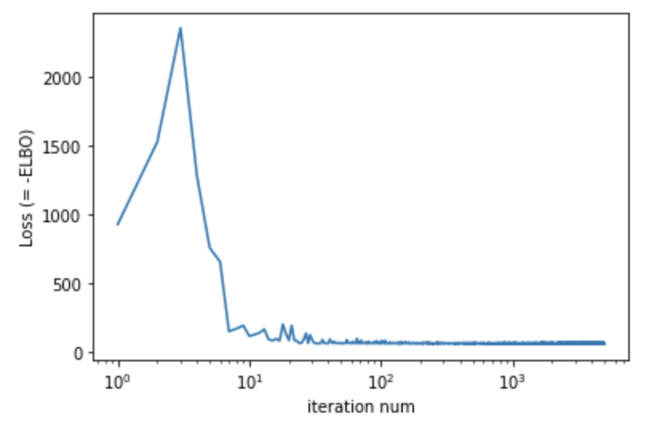
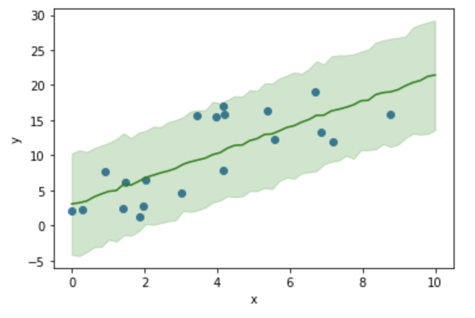

<script type="text/javascript" async src="https://cdnjs.cloudflare.com/ajax/libs/mathjax/2.7.7/MathJax.js?config=TeX-MML-AM_CHTML">
</script>
<script type="text/x-mathjax-config">
 MathJax.Hub.Config({
 tex2jax: {
 inlineMath: [['$', '$'] ],
 displayMath: [ ['$$','$$'], ["\\[","\\]"] ]
 }
 });
</script>

# ベイズ線形回帰

本節では回帰問題をPyroを使ってベイズ機械学習（ここでは変分近似）の枠組みで考えていきます。回帰問題は一般に説明変数$\mathbf{x}$と目的変数$y$の$N$個のセット、すなわち
$$
\mathcal{D}={(\mathbf{x}_1, y_1),\cdots(\mathbf{x}_i, y_i)\cdots ,(\mathbf{x}_N, y_N)}
$$
が与えられたとき、それぞれのサンプルに対して
$$
y_i = f(\mathbf{w}, \mathbf{x}_i, \epsilon_i)\tag{1}
$$
のように$y_i$を未知のパラメータ$\mathbf{w}$と説明変数$\mathbf{x}_i$と観測誤差$\epsilon_i$の関数で表されると仮定し、パラメータ$\mathbf{w}$をデータセット$\mathcal{D}$から推論するタスクになります。

$\mathbf{X}=\lbrace\mathbf{x}_1,\cdots, \mathbf{x}_N\rbrace$、$\mathbf{Y}=\lbrace y_1,\cdots, y_N\rbrace$とすると、$\mathbf{w}$、$\mathbf{X}$、$\mathbf{Y}$の同時確率は

$$
p(\mathbf{X},\mathbf{Y},\mathbf{w})=p(\mathbf{w})\prod_{i=1}^{N}p(y_i|\mathbf{x}_i,\mathbf{w})p(\mathbf{x}_i)\tag{2}
$$
と書けることが分かります。ここで各サンプル間は独立であることをを仮定しており積の形で表せることに注意してください。この同時確率はグラフィカルモデルで表すと下図のように書けます。

<center>

</center>

$\mathbf{X}$と$\mathbf{Y}$の組みが観測されたときの$\mathbf{w}$の事後分布は、事後確率の定義と(2)式から以下のように書けることが分かります。
$$
\begin{align} 
p(\mathbf{w}|\mathbf{X},\mathbf{Y})& =\frac{p(\mathbf{X},\mathbf{Y},\mathbf{w})}{p(\mathbf{X},\mathbf{Y})}\newline
& =\frac{p(\mathbf{w})\prod_{i=1}^{N}p(y_i|\mathbf{x}_i,\mathbf{w})p(\mathbf{x}_i)}{p(\mathbf{Y}|\mathbf{X})p(\mathbf{X})}\newline
& = \frac{p(\mathbf{w})\prod_{i=1}^{N}p(y_i|\mathbf{x}_i,\mathbf{w})}{p(\mathbf{Y}|\mathbf{X})}\tag{3}
\end{align}
$$
ここで２行目から３行目はデータサンプル間の独立性から$p(\mathbf{X})=\prod_{i}p(\mathbf{x}_i)$と書けることを利用しています。

このパラメータ$\mathbf{w}$の事後分布をデータから推定するタスクがベイズ回帰です。

## ■１次元線形回帰
まずは回帰の最も簡単な例として１次元線形回帰を考えていきましょう。この場合(1)式の具体的な関数型として
$$
y_i=w_0 + w_1 x_i + \epsilon_i \tag{4}
$$
と仮定することに相当します。ここで$\epsilon_i$を平均0、標準偏差$\sigma$のガウス分布に従う、つまり
$$
\epsilon \sim \mathcal{N}(\epsilon|0, \sigma) \tag{5}
$$
と仮定すると、(4)、(5)式をまとめることで(2)式の中の$p(y_i|\mathbf{x}_i,\mathbf{w})$は具体的に
$$
p(y_i|\mathbf{x}_i,\mathbf{w})=\mathcal{N}(y_i|w_0+w_1 x_i, \sigma)\tag{5}
$$
と書けることが分かります。
ここで観測誤差の広がり度合いを示す$\sigma$も推定したいパラメータとすると(2)式は
$$
p(\mathbf{X},\mathbf{Y},w_0,w_1,\sigma)=p(w_0)p(w_1)p(\sigma)\prod_i\mathcal{N}(y_i|w_0+w_1 x_i, \sigma)p(x_i)\tag{6}
$$
という具体的な形に書くことができます。またこの同時確率をグラフィカルモデルで記述すれば以下の図のようになります。
<center>

</center>

ここで未知のパラメータ$w_0$、$w_1$、$\sigma$（以降、これらを潜在変数と呼ぶ）の事後確率分布を求めるのが今回の一次元線形回帰のタスクになります。まずは
(6)式の確率モデルをPyroを用いて記述し変分推定を行っていくところをみていきましょう。

なお以降では下記のコードを実行されている前提で話を進めていきます。

**※プログラムコードの全体は[Github](https://github.com/a-mitani/pyro_code_examples/blob/main/pyro_linear_regression.ipynb)上に公開しています。**

```python
import matplotlib.pyplot as plt
import numpy as np

import torch
from torch.distributions import constraints

import pyro
import pyro.distributions as dist
from pyro.infer import SVI, Trace_ELBO
from pyro.infer import Predictive


np.random.seed(1)
pyro.set_rng_seed(1)
```
また、下記のコードで生成されるToyデータセットを例に進めていきます。
```python
def create_linear_data(w0=3.0, w1=2.0, sigma=5.0, size=20):
    x = np.random.rand(size) * 10.0
    y = w0 + w1 * x
    y = y + np.random.normal(scale=sigma, size=x.shape[0])
    return x, y

x, y = create_linear_data()
train = torch.tensor(np.array([x, y]).T, dtype=torch.float)
```
このコードで生成されるデータは(1)式において$w=2.0$、$b=3.0$とし、観測誤差が標準偏差5.0のガウス分布で発生するとしたデータになります。生成されたデータは以下のグラフのようになります。このToyデータセットをもとにベイズ線形回帰を行っていきましょう。
<center>

</center>

### 確率モデルの構築
(6)式の確率モデルをPyroを用いて関数として定義します。
```python
def model(x, y):
    w0 = pyro.sample("w0", dist.Normal(0., 10.))
    w1 = pyro.sample("w1", dist.Normal(0., 10.))
    sigma = pyro.sample("sigma", dist.Uniform(0., 10.))
    mean = w0 + w1 * x
    with pyro.plate("data", len(x)):
        pyro.sample("obs", dist.Normal(mean, sigma), obs=y)
```
ここで、w0とw1の事前確率分布は平均0で標準偏差10の正規分布、sigmaは0~10の値をとる一様分布としていることになります。

### 変分関数を指定
次に変分関数を定義します。こちらも[Pyroでの変分推論](docs/pyro_vi/)の節と同様、guide関数で実装することになります。今回は以下のコードのように実装します。
```python
def guide(x, y):
    w0_loc = pyro.param('w0_loc', torch.tensor(0.))
    w0_scale = pyro.param('w0_scale', torch.tensor(1.), constraint=constraints.positive)
    w1_loc = pyro.param('w1_loc', torch.tensor(0.0))
    w1_scale = pyro.param('w1_scale', torch.tensor(1.0), constraint=constraints.positive)
    sigma_loc = pyro.param('sigma_loc', torch.tensor(1.), constraint=constraints.positive)
    sigma_scale = pyro.param('sigma_scale', torch.tensor(0.5), constraint=constraints.positive)
    w0 = pyro.sample("w0", dist.Normal(w0_loc, w0_scale))
    w1 = pyro.sample("w1", dist.Normal(w1_loc, w1_scale))
    sigma = pyro.sample("sigma", dist.Normal(sigma_loc, sigma_scale))
```
上記コードでは、今回推定したいパラメータ（潜在変数）$w_0$、$w_1$、$\sigma$の事後確率分布をそれぞれ正規分布と仮定していることになります。正規分布を特徴付けるパラメータは平均`loc`と標準偏差`scale`のため、以降の推論パートではELBO最大にするように潜在変数毎のこれら２つのパラメータを最適化することになります。そのため潜在変数それぞれの平均と標準偏差を`pyro.param`を用いて定義することにより、これらが最適化対象の変数であるということをPyroに伝えます。また標準偏差は正の値をとるため`constraint=constraints.positive`として正値のみをとるように制約条件を課していることに注意してください。また、繰り返しですが`guide`関数の引数は`model`関数と同一でないといけないことに注意してください。

### 推論
確率モデルと変分関数を定義したら、あとは推論を行っていきます。こちらも[変分推論を試す](docs/pyro_vi/)と同様であることがわかるでしょう。
```python
optimizer = pyro.optim.Adam({"lr": .1})
svi = SVI(model, guide, optimizer, loss=Trace_ELBO())

x, y = train[:, 0], train[:, 1]
pyro.clear_param_store()
num_iters = 5000
iter_nums = []
losses = []
for i in range(num_iters):
    loss = svi.step(x, y)
    iter_nums.append(i + 1)
    losses.append(loss)
    if i % (num_iters / 10) == 0:
        print("Elbo loss: {}".format(loss))

plt.plot(iter_nums, losses)
plt.xscale("log")
plt.show()

## Output
# Elbo loss: 929.2532387375832
# Elbo loss: 62.93969136476517
# Elbo loss: 63.404844522476196
# Elbo loss: 64.26783436536789
# Elbo loss: 64.90034347772598
# Elbo loss: 63.357214510440826
# Elbo loss: 62.72878021001816
# Elbo loss: 73.45997166633606
# Elbo loss: 63.51271438598633
# Elbo loss: 63.471219420433044
```
<center>

</center>
出力されるプロットを確認すれば、ELBO（のマイナス値）は十分収束しているのが分かります。

### 学習モデルの確認
学習結果のパラメータの内容は`pyro.get_param_store()`から参照可能です。最適化されたパラメータを出力してみましょう。
```python
for name, value in pyro.get_param_store().items():
    print("{} = {:.3f}".format(name, pyro.param(name).item()))

### Output
# w0_loc = 2.959
# w0_scale = 0.840
# w1_loc = 1.842
# w1_scale = 0.182
# sigma_loc = 4.156
# sigma_scale = 0.614
```

これらのパラメータから潜在変数の事後確率分布をプロットしてみましょう。
```python
x_range = np.arange(0.0, 6.0, 0.01)

latent_vars = ["w0", "w1", "sigma"]

for latent_var in latent_vars:
    param_loc = latent_var + "_loc"
    param_scale = latent_var + "_scale"
    inferred_dist = dist.Normal(pyro.param(param_loc).item(), pyro.param(param_scale).item())
    inferred_y = [inferred_dist.log_prob(torch.tensor([x])).exp() for x in x_range]
    plt.plot(x_range, inferred_y)

plt.show()
```
<center>

</center>

学習の結果、潜在変数の事後分布はトイデータを作成した正解の値に近いところを中心にそれぞれ分布しているのが見て取れます。
また、潜在変数の事後分布の平均値で回帰直線を引いてみると以下のようになります。
```python
plt.scatter(x, y)
x_test = np.arange(0, 10, 0.1)
w0_loc = pyro.param("w0_loc").item()
w1_loc = pyro.param("w1_loc").item()
y_test = w0_loc + w1_loc * x_test
plt.plot(x_test, y_test)
plt.show()
```

<center>

</center>

サンプルに沿った回帰直線が引けて学習が正常に動いているのが見て取れます。

**Hint**

今回は変分関数としてガウス分布を指定しているため、事後分布の平均値はすなわち事後分布の最大点と等しくなります。つまり上の図はMAP推定をした場合の回帰直線を意味していることになります。


また学習した潜在変数の事後分布からサンプリングを行うことも可能です。サンプリングには下記のコードのように`pyro.infer.Predictive`のクラスを利用すると便利です。
```python
X_range = torch.tensor(np.linspace(0, 10, 50))
 
predictive = Predictive(model=model, guide=guide, num_samples=1000, return_sites=["w0", "w1", "obs"])
predict_samples = predictive.get_samples(X_range, None)
```
このコードでは`X_range`変数に格納された$x=0\sim 10$の範囲の50の点それぞれに対して、指定された`model`と`guide`の関数に従って1000回サンプリングを行うことをしています。またサンプリングされる量は`return_sites`で指定された確率変数がサンプリングされます。

さて、これを利用して回帰直線の90%信頼区間をプロットしてみます。
```python
sampled_vals = predict_samples["w0"] + predict_samples["w1"] * X_range
mean_vals = sampled_vals.mean(0)
percent05_vals = sampled_vals.kthvalue(int(sampled_vals.shape[0] * 0.05), dim=0)[0]
percent95_vals = sampled_vals.kthvalue(int(sampled_vals.shape[0] * 0.95), dim=0)[0]

plt.scatter(x, y)
plt.plot(X_range, mean_vals, color='r')
plt.fill_between(X_range, percent05_vals, percent95_vals, color='r', alpha=0.2)
```
2行目でサンプリングされた$w_0$,$w_1$をもとに目的変数$y$を計算しています。４と５行目で、これらサンプリングされた点から5%,95%パーセンタイル値を取得。結果をプロットしています。

<center>

</center>

90%信頼区間の領域中に多くの観測値が入っていないのに注意してください。これは上図が**回帰線の信頼区間**をプロットしており観測誤差を考慮にいれていないことに起因します。

上図のような信頼区間の回帰線に観測誤差$\sigma$が加わる「観測値」はどの範囲に広がるのかを調べてみます。ここでは「観測値」の90%信頼区間をプロットしてみましょう。`model`関数内で観測誤差$\sigma$を含んだ観測値は`obs`変数として定義したのを思い出すと、`obs`変数のサンプリング値を利用すると目的の信頼区間が得られることが分かります。上記の回帰直線の信頼区間をプロットしたのと同様に以下のコードで観測値90%信頼区間がプロットできます。

```python
# 観測誤差も考慮したの90%信頼区間をプロット
sampled_vals = predict_samples["obs"]
mean_vals = sampled_vals.mean(0)
percent05_vals = sampled_vals.kthvalue(int(sampled_vals.shape[0] * 0.05), dim=0)[0]
percent95_vals = sampled_vals.kthvalue(int(sampled_vals.shape[0] * 0.95), dim=0)[0]

plt.scatter(x, y)
plt.plot(X_range, mean_vals, color='g')
plt.fill_between(X_range, percent05_vals, percent95_vals, color='g', alpha=0.2)
```
<center>

</center>

多くの観測値が90%信頼区間に入っており、今回ベイズ学習した回帰モデルでデータセットが上手く表現出来ていることが見て取れます。このように学習したモデルが実際の観測値を再現できるかを確認することはモデルの有効性を評価・確認する上で重要です。

