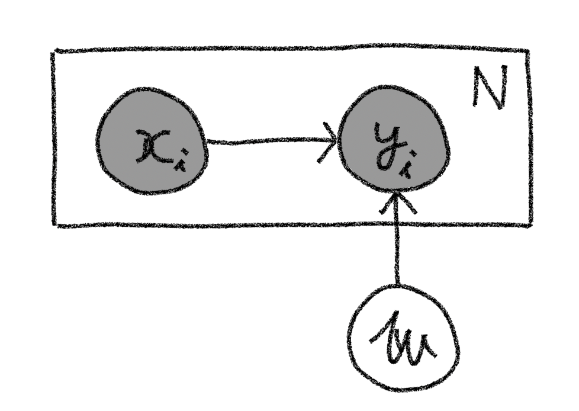
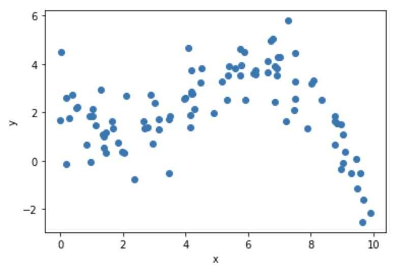
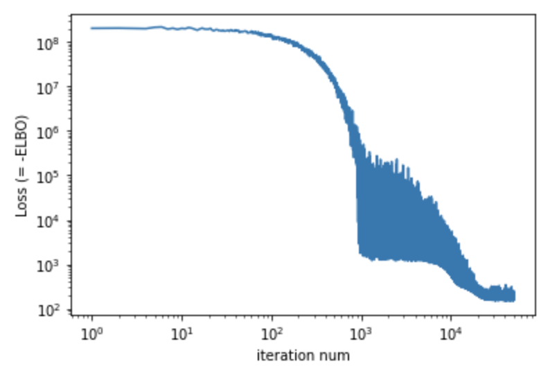
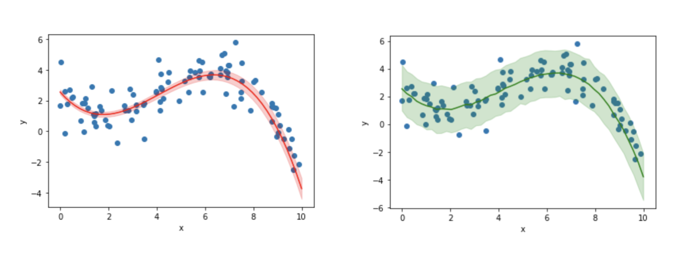
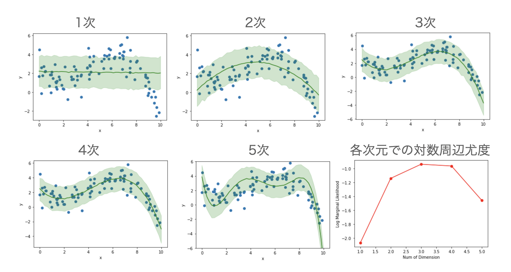

<script type="text/javascript" async src="https://cdnjs.cloudflare.com/ajax/libs/mathjax/2.7.7/MathJax.js?config=TeX-MML-AM_CHTML">
</script>
<script type="text/x-mathjax-config">
 MathJax.Hub.Config({
 tex2jax: {
 inlineMath: [['$', '$'] ],
 displayMath: [ ['$$','$$'], ["\\[","\\]"] ]
 }
 });
</script>

# モデル選択：周辺尤度最大化
本節では前多項式回帰を題材に、周辺尤度が最大となるモデルを選択するモデル選択手法をPyroで実際に行う方法を見ていきます。

## ■ 多項式回帰のモデリング
多項式回帰としてモデリングする場合、説明変数$\mathbf{x}$と目的変数$y$の$N$個のセット、すなわち
$$
\mathcal{D}={(\mathbf{x}_1, y_1),\cdots(\mathbf{x}_i, y_i)\cdots ,(\mathbf{x}_N, y_N)}
$$
が与えられたとき、それぞれのサンプルに対して
$$
y_i=\mathbf{w}^T\cdot \mathbf{x}_i + \epsilon_i \tag{1}
$$
という関数型に従うことを仮定することに相当します。ここで$M$次元の多項式を仮定するとすると、$\mathbf{w} = (w_0, ..., w_M)^T$, $\mathbf{x}_i = (x^0, x^1, x^2, ..., x^M)^T = (1, x, x^2, ..., x^M)^T$となります。

ここで$\epsilon_i$を平均0、標準偏差$\sigma$のガウス分布に従う、つまり
$$
\epsilon \sim \mathcal{N}(\epsilon|0, \sigma) \tag{2}
$$
と仮定すると、(1)、(2)式をまとめることで目的変数の確率分布$p(y_i|\mathbf{x}_i,\mathbf{w})$は
$$
p(y_i|\mathbf{x}_i,\mathbf{w})=\mathcal{N}(y_i|\mathbf{w}\cdot\mathbf{x}_i, \sigma)\tag{3}
$$
のように書けることが分かります。
簡単のため、今回は観測誤差の広がり度合いを示す$\sigma$は既知の定数とすると[^const]、同時確率分布は
$$
p(\mathbf{X},\mathbf{Y},\mathbf{w})=p(\mathbf{w})\prod_i\mathcal{N}(y_i|\mathbf{w}\cdot\mathbf{x}_i)p(\mathbf{x}_i)\tag{4}
$$
という具体的な形に書くことができます。

またこの同時確率をグラフィカルモデルで記述すれば以下の図のようになります。
<center>

</center>


このモデルに従い、前節の線形回帰モデルを拡張することで多項式回帰をPyroで実装していくことにします。なお以降では下記のコードを実行されている前提で話を進めていきます。

**※プログラムコードの全体は[Github](https://github.com/a-mitani/pyro_code_examples/blob/main/model_selection.ipynb)上に公開しています。**

```python
import matplotlib.pyplot as plt
import numpy as np

import torch
from torch.distributions import constraints

import pyro
import pyro.distributions as dist
from pyro.infer import SVI, Trace_ELBO
from pyro.infer import Predictive
from pyro.infer.autoguide import AutoDiagonalNormal

np.random.seed(1)
pyro.set_rng_seed(1)
```

また、下記のコードで生成されるToyデータセットを例に進めていきます。
```python
def create_poly_data(coef, size, x_max, sigma):
    x = np.random.rand(size) * x_max
    y = np.zeros(size)
    for i in range(len(coef)):
        y += coef[i] * x ** i
    y += np.random.normal(scale=sigma, size=size)
    return x, y

COEF = [2, -1.5, 0.6, -0.05]
X_MAX = 10
SIGMA = 1.0

x, y = create_poly_data(COEF, 100, X_MAX, SIGMA)
train = torch.tensor(np.array([x, y]).T, dtype=torch.float)

plt.scatter(x, y)
plt.xlabel('x')
plt.ylabel('y')
plt.show()
```
生成されたデータは以下のグラフのようになります。このToyデータセットをもとにベイズ線形回帰を行っていきましょう。
<center>

</center>

## ■ 多項式回帰の実装
### 確率モデル
(3)式の確率モデルをPyroを用いた関数として定義します。
```python
def model(x, y, model_dim, sigma):
    param_dim = model_dim + 1
    w = pyro.sample("w", dist.Normal(0.0, 10.0).expand([param_dim]).to_event(1))
    mean = torch.zeros_like(x)
    for i in range(param_dim):
        mean += w[i] * (x ** i)
    with pyro.plate("data", len(x)):
        pyro.sample("obs", dist.Normal(mean, sigma), obs=y)
```
実装コードを詳しくみていきます。

2行目で今回学習したいパラメータ $\mathbf{w}$の次元数を定義しています。`model_dim`はモデルの次元、つまり何次多項式としてモデリングするかの変数であり、`param_dim`は定数項の分を加えた`model_dim+1`となります。（なお、後々のモデル選択の話の際に便利なようにここで`model_dim`はモデルの引数として外から指定できるように実装しています。）

3行目はパラメータ$\mathbf{w}$の事前分布を多次元正規分布として定義しています。そして全ての成分の平均値は`0.0`、標準偏差が`10.0`とし、かつ各成分は独立（つまり分散共分散行列の非対角成分はゼロ）と仮定していることになります。また`expand`や`to_event`関数については[確率分布の取り扱い]()の節を参照してください。

4~8行目は目的変数$y_i$を定義しており、(1)式より観測平均$\mathbf{w}^T\cdot \mathbf{x}_i$に対して、各観測個別に平均ゼロ、標準偏差$\sigma$の観測ノイズが乗った値と仮定おり、その仮定をそのまま実装しているのがわかるでしょう。

### 変分関数
次に変分関数を定義しますが、ここではPyroの`AutoGuide`クラスを利用して実装すると以下のような1行で済みます。
```python
guide = AutoDiagonalNormal(model)
```
`AutoGuide`クラスは引数の`model`内で指定された名前付きの確率変数（ただし`obs`指定されたものを除く）がベイズ学習対象と自動認識し、各変数に対して規定された変分関数を自動生成するものになります。ここでは`AutoGuide`のサブクラスである`AutoDiagonalNormal`を用いており、これはすなわち`model`内の`w`の変分関数を分散共分散行列の非対角成分がゼロの多次元正規関数の形をとる変分関数を規定した事に相当します。

### 推論
確率モデルと変分関数を規定したら、あとはELBOを最大化するようなパラメータを求める学習を行うだけです。下記のコードのように実装が出来ます。ここでは今回の学習対象のtoyデータを見ると微分値がゼロとなるようなのが２点程度ありそうなので、３次多項式で表現出来そうかな、とあたりを付けて`model_dim=3`として学習をしています。
```python
model_dim = 3
optimizer = pyro.optim.Adam({"lr": .01})
svi = SVI(model, guide, optimizer, loss=Trace_ELBO())

x, y = train[:, 0], train[:, 1]
pyro.clear_param_store()
num_iters = 50000
iter_nums = []
losses = []
for i in range(num_iters):
    loss = svi.step(x, y, model_dim, SIGMA)
    iter_nums.append(i + 1)
    losses.append(loss)
    if i % (num_iters / 10) == 0:
        print("Elbo loss: {}".format(loss))

plt.plot(iter_nums, losses)
plt.xscale("log")
plt.yscale("log")
plt.xlabel('iteration num')
plt.ylabel('Loss (= -ELBO)')
plt.show()
```
実行結果のLossの変化は下図のようになり、十分収束してそうなのがみて取れるかと思います。

<center>

</center>

### 学習結果
今回学習して得られた学習パラメータの結果を表示してみます。

```python
for name, value in pyro.get_param_store().items():
    print(name, value)

## Output
# AutoDiagonalNormal.loc Parameter containing:
# tensor([ 2.5502, -1.8158,  0.6533, -0.0535], requires_grad=True)
# AutoDiagonalNormal.scale tensor([0.0949, 0.0155, 0.0024, 0.0003], grad_fn=<AddBackward0>)
```
`AutoDiagonalNormal`を利用したため、今回の推定パラメータである平均と標準偏差はそれぞれ`AutoDiagonalNormal.loc`、`AutoDiagonalNormal.scale`というKeyで格納されているのがみて取れます。

数値だけでは学習結果の妥当性が見えないので実際に今回推定されたパラメータで、前節と同様に回帰曲線と観測値の90%信頼区間をプロットしてみると、それぞれ以下の左と右の図のようになります[^fig]。今回の結果が観測データを上手く表現出来ていそうだというのがみて取れるかと思います。


<center>

</center>

## ■ モデル選択：周辺尤度最大化

さて、今回のトイモデルに対しては３次の多項式で回帰することでデータを上手く表現出来ることが定性的に見て取れましたが、他のモデルの方が観測データをより上手く表現できる可能性も捨てきれません。例えば２次多項式や４次多項式での回帰モデルの方が今回のデータをより上手く表現できる可能性があります。そのことを確認するためにそれぞれのモデルで回帰したうえで結果を比較し、最も上手く観測データを表現できるモデルを探すのが**モデル選択**です。

しかしモデル選択のためにはモデル同士でどちらがより上手く観測データを表現出来ているかを比較するための定量的な指標が必要になります。ベイズ学習ではしばしば**周辺尤度(Marginal Likelihood)** [^marg]と呼ばれる量が最も大きくなるモデルを選択することを行います（周辺尤度最大化）。

### 周辺尤度
改めて観測データ$\mathbf{X}$, $\mathbf{Y}$とパラメータ$\mathbf{w}$の同時確率を考えると、事後確率との関係から
$$
p(\mathbf{X}, \mathbf{Y}, \mathbf{w})=p(\mathbf{X}, \mathbf{Y}| \mathbf{w})p(\mathbf{w})
$$
と書けます。この式を両辺$\mathbf{w}$について積分すると、
$$
p(\mathbf{X}, \mathbf{Y})=\int p(\mathbf{X}, \mathbf{Y}| \mathbf{w})p(\mathbf{w})d\mathbf{w}
$$
この$p(\mathbf{X}, \mathbf{Y})$を**周辺尤度**と呼びます。右辺を見ると、周辺尤度はベイズ学習により得られた確率分布$p(\mathbf{w})$のもとでの、観測データの生起確率$p(\mathbf{X}, \mathbf{Y})$の期待値を表していることがわかります。そのためこの周辺尤度が最も大きいモデルを選択することはそのモデルから観測データが最も生起しやすいことを示している事になります。
また周辺尤度の対数（対数周辺尤度）をとっても、モデル間の周辺尤度の大小関係は変わらないため、しばしば以下の対数周辺尤度を求めてその大小関係からモデル選択が行われます。
$$
\ln p(\mathbf{X}, \mathbf{Y})=\int \ln p(\mathbf{X}, \mathbf{Y}| \mathbf{w})p(\mathbf{w})d\mathbf{w}
$$

### 対数周辺尤度の計算
具体的に今回の多項式回帰モデルでの対数周辺尤度を求めていきましょう。ここで上式右辺の積分は一般的に解析的に求めるのは難しいため、今回はモンテカルロ積分で近似計算する方法をとることにします。すると対数周辺尤度は以下のように書けます。
$$
\begin{align} 
\ln p(\mathbf{X}, \mathbf{Y})
&= \int \ln p(\mathbf{X}, \mathbf{Y}| \mathbf{w})p(\mathbf{w})d\mathbf{w}\newline
&\approx \frac{1}{T} \sum_{t=1}^{T} \ln p(\mathbf{X}, \mathbf{Y}| \mathbf{w}^{(t)})\newline
&= \frac{1}{T} \sum_{t=1}^{T} \sum_{i=1}^{N}\ln \mathcal{N}(y_i|\mathbf{w}^{(t)}\cdot \mathbf{x}_i, \sigma)
\end{align} 
$$
ここで2行目は積分をモンテカルロ積分で近似しており、$\mathbf{w}^{(t)}$は回帰パラメータの確率分布$p(\mathbf(w))$からのサンプリング値を示しています。また3行目は(3)式を用いています。

この式に従って対数周辺尤度を求めるコードをPyroを用いて実装すると以下のようになります。
```python
SAMPLE_NUM = 1000
predictive = Predictive(model=model, guide=guide, num_samples=SAMPLE_NUM, return_sites=["w"])
predict_samples = predictive.get_samples(x, None, model_dim, SIGMA)

predicted_mean = torch.zeros((SAMPLE_NUM, len(x)))
for i in range(model_dim + 1):
    predicted_mean += predict_samples["w"][:, :, i] * (x ** i)

sum_log_prob = torch.zeros(SAMPLE_NUM)
for i in range(len(x)):
    normal_1d = dist.Normal(predicted_mean[:, i], SIGMA)
    sum_log_prob = normal_1d.log_prob(y[i])
log_marginal_likelihood = torch.mean(sum_log_prob)
print("log_marginal_likelihood = ", log_marginal_likelihood.item())

## Output
# log_marginal_likelihood =  -0.9372764825820923
```
コードを詳しく見ていきます。

まず1~3行目では今回学習したパラメータの確率分布$p(\mathbf{w})$から$\mathbf{w}$を1,000回サンプリングし、5~7行目ではそのサンプル値と観測目的変数$x_i$からy_iの平均を求めています。9~13行目は$y_i$の平均値と観測ノイズの標準偏差$\sigma$で特徴づけられる正規分布から実際の観測値S$y_i$が得られる確率密度を求めて各サンプルについての和をとることで対数尤度分布を計算しています。

下の図は上記の一連のコードで、多項式回帰の次元数を定義する`model_dim`の値を変更することで、1次元〜5次元の多項式回帰モデルでの回帰曲線の90%信頼区間をプロットしたものと、回帰モデルの次元数と対数周辺尤度の大きさの関係をプロットしたものになります[^decay]。3次または4次多項式のモデルが最も対数周辺尤度が大きく今回の観測データを表現するのに適しているのが見て取れます。モデルとして1次元や2次元での回帰では表現力が低く、また５次では複雑なモデルが故に観測誤差にも合せ込もうとしてしまっているのが見て取れるでしょう。

<center>

</center>


[^const]: 前節と同様にすることで、$\sigma$を推定対象にすることも可能です。
[^fig]:ここではサンプルコードは省略します。Github上のコード例を参照してください。
[^marg]: モデルエビデンス(Model Evidence)とも呼ばれることもあります。またこの量の対数をとり符号を逆転した量は、自由エネルギー(Free Energy）とも呼ばれます。
[^decay]: 5次多項式は収束が遅いため、サンプルコードに最適化時に学習率の減衰の機構を入れて求めています。