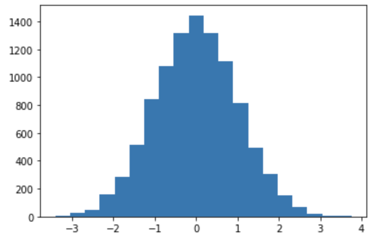
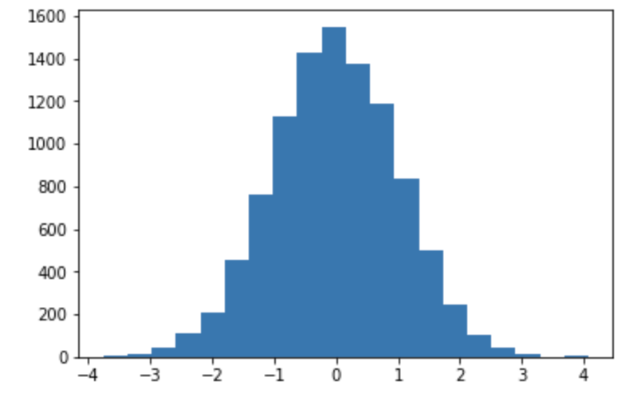

<script type="text/javascript" async src="https://cdnjs.cloudflare.com/ajax/libs/mathjax/2.7.7/MathJax.js?config=TeX-MML-AM_CHTML">
</script>
<script type="text/x-mathjax-config">
 MathJax.Hub.Config({
 tex2jax: {
 inlineMath: [['$', '$'] ],
 displayMath: [ ['$$','$$'], ["\\[","\\]"] ]
 }
 });
</script>

# Pyroによる確率モデリング
前節で「Pyroにより確率変数やそれらを組み合わせた確率モデルを容易に扱うことが可能になる」ことを述べました。本節ではもう少し詳しくPyroがどのように確率変数や確率モデルを扱うのかをみていきたいと思います。

Pyroでは大きく２つの構成要素により確率変数や確率モデルを扱います。１つが**確率プリミティブ**。もう１つが確率モデルのハンドラである**poutine**です。以下でそれぞれ詳しくみていきましょう。

以降、前節の手順でpyroがインストールされ、以下の`import`が実行されている前提で話を進めます。
```python
import matplotlib.pyplot as plt
import pyro
import pyro.distributions as dist
from pyro.poutine import trace
```

## ■確率プリミティブ
一般的にベイズ学習において確率モデルは確率的に実現値が変動する「確率変数」の組み合わせで構成されます。そしてPyro上で確率変数を宣言するものが**確率プリミティブ**です。

### 確率変数の宣言
例えば平均0で標準偏差が1のガウス分布に従う確率変数$X$を考える時、Pyroでは$X$を
```python
x = pyro.sample("X", dist.Normal(0, 1))
print(x)
## Output
# tensor(0.0784)
```
のように`pyro.sample`を用いて宣言します。ここで第一引数は確率変数名を宣言しており、後に行う推論などではこの名前を確率変数のIDとして処理を行います（そのために一意に命名する必要があります。）。第二引数は確率変数$X$の従う確率分布を指定しており、今回は正規分布の`Normal`を用いています。
また、`pyro.sample`関数は指定された確率分布にしたがって値をサンプリングする関数となっており、python変数である`x`にはサンプリングされた実現値が代入されることになります（2行目`print`文）。

確率変数$X$から独立同分布(i.i.d)で実現値をサンプリングしたければ、以下のコード例のように`pyro.sample`文をforループを回すことで可能です。
```python
x_list = []
for _ in range(10000):
    x = pyro.sample("X", dist.Normal(0, 1))
    x_list.append(x)
plt.hist(x_list, bins=20)
```
<center>

</center>

### `plate`を用いたサンプリング
確率変数から多数のサンプリングを行う場合、上記のようにforループを用いてシーケンシャルにサンプリングを行うことは計算効率がよくありません。そこでPyroでは効率よくサンプリングを行うために`pyro.plate`というコンテキストマネージャが用意されており、上記のFor文によるサンプリングと同様のことを下記のコードで行うことができます。
```python
with pyro.plate("plate1", size=10000):
    samples = pyro.sample("samples", dist.Normal(0, 1))
print("var_type is {}, shape = {}".format(type(samples), samples.shape))
plt.hist(samples, bins=20)
## Output
# var_type is <class 'torch.Tensor'>, shape = torch.Size([10000])
```
当然ですが出力されるヒストグラムもFor文の結果と同様の形になります。
<center>

</center>


`pyro.plate`はそのコンテキスト内でサンプルされた事象はお互いに独立であることをPyroに明示的に伝える役割があります。このことは特に推論時の処理時間に非常に大きな影響を与えます。なぜなら独立である場合はサンプリング時に並列処理を行うことができるからです。

実際に手元の処理時間を比較すると、For文によるサンプリングが0.72秒で、`plate`を利用した場合は0.003秒と200倍以上の速度差がでました。`plate`で得られた変数値はサンプル数だけ要素を持った１つのtorch.Tensor型の変数に格納されていることにも注意してください。

以上のことからそれぞれ独立にサンプルする場合は積極的に`pyro.plate`を用いることが推奨されます。


### 確率モデルの宣言
確率モデルは、確率プリミティブの演算の組み合わせで構成された**Python関数として宣言**します。

簡単な確率モデルをPyroで定義する例をみてみましょう。ここでは以下のような例を考えます。

**例:赤玉白玉問題** 下図のように、２つの袋$a$および$b$があり、袋$a$には赤玉が2個、白玉が1個入っており、袋$b$には赤玉が1個、白玉が3個入っているものとします。ここで、２つの袋のうち一方の袋を等確率にランダムに選び、その選んだ袋から玉を１つ取り出す試行を行います。
<center>

</center>
ここで「袋が選ばれる」「玉が取り出される」という確率的な過程をそれぞれ確率変数$X$、$Y$とすると上の試行は下記のグラフィカルモデルのように記述出来ます。
<center>

</center>

この確率モデルは下記の`ball_model`のようなpython関数として定義することができます。4行目では確率変数$X$の分布を`p=0.5`のベルヌーイ分布を指定しています。ここで確率変数$X$の実現値が1の場合は袋aを、0の場合は袋bが選ばれたものとします。そして選ばれた袋（確率変数の実現値）に応じて、確率変数$Y$の確率分布がスイッチし、それぞれの袋の中の赤玉と白玉の数に合わせてベルヌーイ分布の確率が指定されています。確率変数$Y$の実現値が1の場合は赤玉を、0の場合は白玉が取り出されたものとします。

ちなみに、このように観測値（今回の場合は取り出した玉の色）がどのような確率過程で生み出されたのかを記述するようなモデルを**生成モデル**と呼ばれます。

```python
# x=1: 袋a,  x=0: 袋b
# y=1: 赤玉, y=0:　白玉
def ball_model():
    x = pyro.sample("X", dist.Bernoulli(0.5))
    if x:  
        y = pyro.sample("Y", dist.Bernoulli(2.0/3.0))
    else: 
        y = pyro.sample("Y", dist.Bernoulli(1.0/4.0))
    return y
```

確率プリミティブの組み合わせで構成された`ball_model`の関数もやはり確率的な挙動を示す確率的関数として動作し、下記のコード例のように、関数が呼ばれたらその関数内で定義されたモデルに従って値をサンプリングする動作をします。（もちろん`pyro.plate`を用いたサンプリングも可能です[^tip]。）

```python
for _ in range(5):
    print(ball_model())
## output
# tensor(0.)
# tensor(0.)
# tensor(1.)
# tensor(0.)
# tensor(1.)
```

### 複雑な確率モデル
確率モデルをPythonの関数の形で書けることは、今後さらに複雑な確率モデルを考えていく上で非常に便利な特徴です。Pythonの関数と同様に、確率モデルに引数を渡したり、再帰的な確率モデルを構築することも容易ですし、関数同士を組み合わせることも可能です。（下記コード例参照）
```python
def geometric(p, t=None):
    if t is None:
        t = 0
    x = pyro.sample("x_{}".format(t), pyro.distributions.Bernoulli(p))
    if x.item() == 1:
        return 0
    else:
        return 1 + geometric(p, t + 1)

print(geometric(0.5))

## output
# 0
```

## ■エフェクト・ハンドラ `poutine`
ここまでで、確率モデルをPythonの関数として実装し、その確率モデルに従ったサンプリングを行うことができました。ベイズ推論などを行っていく際には、その確率モデルの挙動を記録したり、挙動を修正（e.g.条件付けなど）など確率モデルをハンドリングする必要があります。そのようなハンドリング機能を担うのが`poutine`モジュールです。ここでは`poutine`のモジュールの中でよく利用されるものを紹介します。

### 確率モデル挙動の記録 `Trace`
ベイズ推論を行う際には実現値を出力するに至るまでに確率モデルの内部の確率変数がどういう値を取ったのかを知りたい場合が多くあります。Pyroでは`Trace`オブジェクトが確率モデルをサンプルした際の挙動を記録する役割を担います。`Trace`オブジェクトは下記コードのようにして取得します。
```python
traced_model = poutine.trace(model_fn) # TraceMessengerオブジェクトを取得
trace = traced_model.get_trace() # Traceオブジェクトを取得
```
1行目で対象とする確率モデルの`TraceMessenger`オブジェクトを`traced_model`の名前で取得し、2行目の`get_trace`でサンプリングとそのサンプリング時の確率モデルの内部状態を`Trace`オブジェクトに記録しています。ここで対象の確率モデル関数が引数を持つ場合はget_traceの引数に指定することで引数に応じたサンプリングを行います。

`Trace`オブジェクトは有向グラフの形式で確率モデルのサンプリング状態を記録しており、その有向グラフは確率モデルのインプットとアウトプット、そしてモデル内の確率変数をノードとして持ちます。例として以下のコードように`ball_model`の内部状態を出力してみます。
この出力内容を見ると、`ball_model`には関数内で明示的に定義した`'X'`, `'Y'`に加えて`'_INPUT'`、`'_RETURN'`ノードが存在することがわかります。また今回のモデルの実現値は内部のそれぞれの確率変数の実現値（`value`）が`'X'=tensor(0.)`、`'Y'=tensor(1.)`となることでモデルの最終的な出力`'_RETURN'`の実現値が`tensor(1.)`となっていることが窺い知ることができます。
```python
tr = trace(ball_model).get_trace()
for tr_items in tr.nodes.items():
    print(tr_items)
# output
# ('_INPUT', {'name': '_INPUT', 'type': 'args', 'args': (), 'kwargs': {}})
# ('X', {'type': 'sample', 'name': 'X', 'fn': Bernoulli(probs: 0.5), 'is_observed': False, 'args': (), 'kwargs': {}, 'value': tensor(0.), 'infer': {}, 'scale': 1.0, 'mask': None, 'cond_indep_stack': (), 'done': True, 'stop': False, 'continuation': None})
# ('Y', {'type': 'sample', 'name': 'Y', 'fn': Bernoulli(probs: 0.25), 'is_observed': False, 'args': (), 'kwargs': {}, 'value': tensor(1.), 'infer': {}, 'scale': 1.0, 'mask': None, 'cond_indep_stack': (), 'done': True, 'stop': False, 'continuation': None})
# ('_RETURN', {'name': '_RETURN', 'type': 'return', 'value': tensor(1.)})
```

### 条件付け `condition`
`condition`ハンドラを用いてモデル内の各確率変数の実現値を固定（条件付け）してサンプリングを行うことが可能になります。条件付けはkeyを確率変数名、valueを固定する実現値としたdictionary型で`condition`ハンドラに渡します。

この`condition`ハンドラを用いると、例えば、確率モデルの全ての確率変数の実現値を固定した上でサンプリングし、その確率を求めると同時確率を求めらます。以下に、ball_modelにおいて「袋aが選ばれ、赤玉が得られる」場合の同時確率、つまり$p(X=1, Y=1)$を求める例を示します。

ここで、最後の`tr.log_prob_sum()`はモデル内の各確率変数の対数確率の和を出力する関数です。つまりこの例では
$$
ln(p(X=1))+ln(p(Y=1))
$$
を計算してることに注意してください。

```python
ond_dict = {"X": torch.tensor(1.), "Y": torch.tensor(1.)} # 袋a=1, 赤玉=1 
conditioned_model = condition(ball_model, cond_dict)

tr = trace(conditioned_model).get_trace()
for tr_items in tr.nodes.items():
    print(tr_items)

print('p(X=1, Y=1) =',  tr.log_prob_sum().exp().item())

## Output
# ('_INPUT', {'name': '_INPUT', 'type': 'args', 'args': (), 'kwargs': {}})
# ('X', {'type': 'sample', 'name': 'X', 'fn': Bernoulli(probs: 0.5), 'is_observed': True, 'args': (), 'kwargs': {}, 'value': tensor(1.), 'infer': {}, 'scale': 1.0, 'mask': None, 'cond_indep_stack': (), 'done': True, 'stop': False, 'continuation': None})
# ('Y', {'type': 'sample', 'name': 'Y', 'fn': Bernoulli(probs: 0.6666666865348816), 'is_observed': True, 'args': (), 'kwargs': {}, 'value': tensor(1.), 'infer': {}, 'scale': 1.0, 'mask': None, 'cond_indep_stack': (), 'done': True, 'stop': False, 'continuation': None})
# ('_RETURN', {'name': '_RETURN', 'type': 'return', 'value': tensor(1.)})
# p(X=1, Y=1) = 0.3333333134651184
```
上記の出力結果から指定された条件付けに基づいてサンプリングされ、また計算された同時確率$p(X=1, Y=1) = 0.333...$はモデルから解析的に得られる値
$$
p(X=1, Y=1) = p(X=1)P(Y=1) = \frac{1}{2} * \frac{2}{3} = \frac{1}{3}
$$
と一致していることがわかります。

### 確率変数の隠蔽 `block`
`block`ハンドラを用いると、モデル内の指定された確率変数から隠蔽されます。これは例え以下のコードのように`condition`と組み合わせて条件付き確率（$p(X=1|Y=1$）を求めたい時に使うことができます。
```python
cond_dict = {"X": torch.tensor(1.), "Y": torch.tensor(1.)} # 袋a=1, 赤玉=1 
conditioned_model = condition(ball_model, cond_dict)
blocked_model = block(conditioned_model, hide=["X"])

tr = trace(blocked_model).get_trace()
for tr_items in tr.nodes.items():
    print(tr_items)

print('p(Y=1|X=1) =',  tr.log_prob_sum().exp().item())

# Output
# '_INPUT', {'name': '_INPUT', 'type': 'args', 'args': (), 'kwargs': {}})
# ('Y', {'type': 'sample', 'name': 'Y', 'fn': Bernoulli(probs: 0.6666666865348816), 'is_observed': True, 'args': (), 'kwargs': {}, 'value': tensor(1.), 'infer': {}, 'scale': 1.0, 'mask': None, 'cond_indep_stack': (), 'done': True, 'stop': False, 'continuation': None})
# ('_RETURN', {'name': '_RETURN', 'type': 'return', 'value': tensor(1.)})
# p(Y=1|X=1) = 0.6666666269302368
```


**Tips**

Pyroにおける確率モデルのハンドリングする仕組みとして`poutine`を用いて同時確率や条件付き確率を計算する手法を紹介しました。読者によってはコードが少々回りくどい印象を受けるかもしれません。

実際のところは`poutine`モジュールは、Pyroの推論モジュールから呼ばれる前提で設計されており、ユーザー自身が`poutine`を用いて確率モデルをハンドルすることはほとんどありません。


## ■ベイズ学習へ
ここまででPyroを用いて対象の事象に合わせた確率モデル、いわゆる生成モデルを定義することを行ってきました。ベイズ学習ではこの確率モデルに観測されたデータを組み合わせることで、未知のパラメータを学習・推論することになります。例えば、前述の赤玉白玉問題の場合、取り出された玉の色のデータをもとに袋の中の赤玉の数を推定していくことを行います。

Pyroを用いてベイズ学習を実装していく前に、必要最小限のベイズ学習の知識を復讐していきましょう。

[^tip]: `plate`を用いる場合は、Tensorの演算を行うためmodelにif分岐を使えない制約があるためIF文を用いずに等価なモデルを記述する必要があります。ball_modelの場合の実装例を[Gistに載せた](https://gist.github.com/a-mitani/630ef831e8f2238da003a23f25d75e2e)ので参照ください。