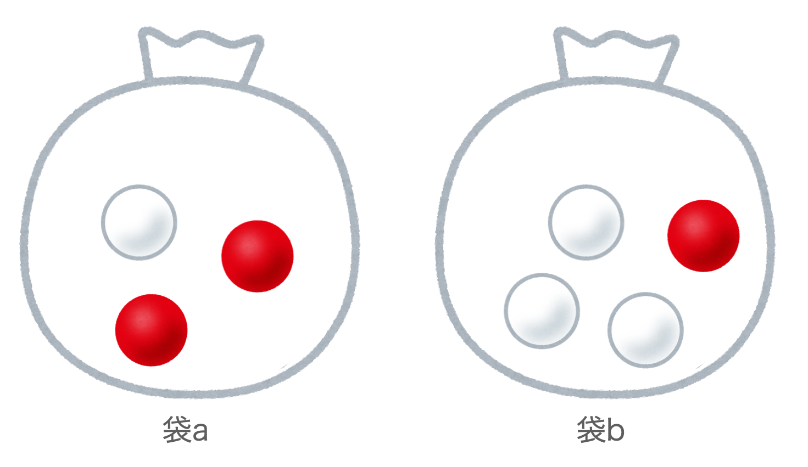
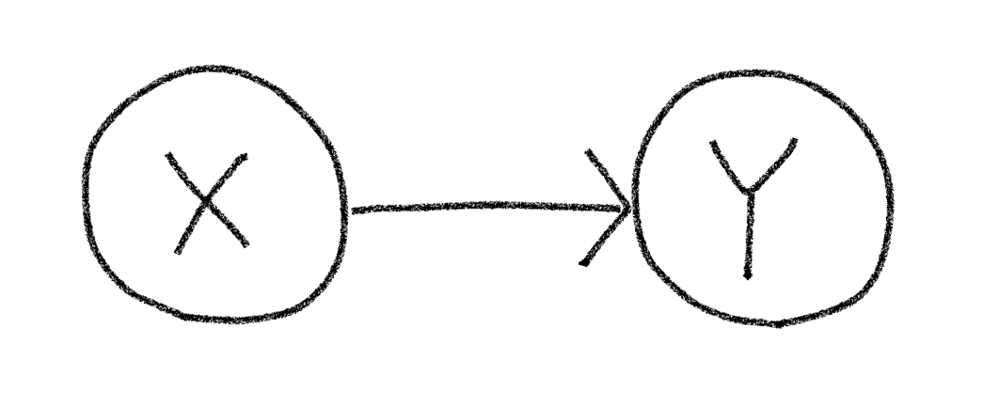

<script type="text/javascript" async src="https://cdnjs.cloudflare.com/ajax/libs/mathjax/2.7.7/MathJax.js?config=TeX-MML-AM_CHTML">
</script>
<script type="text/x-mathjax-config">
 MathJax.Hub.Config({
 tex2jax: {
 inlineMath: [['$', '$'] ],
 displayMath: [ ['$$','$$'], ["\\[","\\]"] ]
 }
 });
</script>

# Pyroによる確率モデリング
前節で「Pyroにより確率変数やそれらを組み合わせた確率モデルを容易に扱うことが可能になる」ことを述べました。ここでは以下のような簡単な例をとおして、Pyroで確率変数をどのように扱うのか、確率モデルをどのように定義するのかなどを見ていきたいと思います。

## 確率プリミティブ
確率モデルは確率的にアウトプットが変動する「確率変数」から構成されます。

例えばベルヌーイ分布に従う確率変数$x$を考える時、Pyroでは$x$を
```python
import pyro
x = pyro.sample("x", dist.Bernoulli(0.5))
```
のように宣言します。ここで`pyro.sample`の第一引数は確率変数の名前を指定しており、のちに行う推論などではこの名前を確率変数のIDとして処理を行います（そのために一意に命名する必要があります。）。また第二引数は確率変数$x$の従う確率分布であり、ここでの例では1と0が等確率に出現する`p=0.5`のベルヌーイ分布を指定しています。

`pyro.sample`関数は指定された確率分布にしたがって値をサンプリングする関数となっており、以下の例で確率分布からサンプリングされている様子が確認することができます。

```python
for _ in range(5):
    x = pyro.sample("x", dist.Bernoulli(0.5))
    print(x)
## output
# tensor(1.)
# tensor(1.)
# tensor(0.)
# tensor(1.)
# tensor(0.)
```

## 簡単なモデルの例
確率プリミティブを用いて簡単な確率モデルをPyroで定義する例をみてみましょう。ここでは以下のような例を考えます。

**例:赤玉白玉問題** 下図のように、２つの袋$a$および$b$があり、袋$a$には赤玉が2個、白玉が1個入っており、袋$b$には赤玉が1個、白玉が3個入っているものとします。ここで、２つの袋のうち一方の袋を等確率にランダムに選び、その選んだ袋から玉を１つ取り出す試行を行います。
<center>

</center>
ここで「袋が選ばれる」「玉が取り出される」という確率的な過程をそれぞれ確率変数$x$、$y$とすると上の試行は下記のグラフィカルモデルのように記述出来ます。
<center>

</center>

Pyroでは確率モデルを確率プリミティブの演算の組み合わせで構成された**Python関数として定義**します。上の確率モデルであれば下記の`ball_model`のように定義することができます。このように観測値（今回の場合は取り出した玉の色）がどのような確率過程で生み出されたのかを記述するようなモデルを**生成モデル**と呼びます。

```python
import pyro
import pyro.distributions as dist

# x=1: 袋a,  x=0: 袋b
# y=1: 赤玉, y=0:　白玉
def ball_model():
    x = pyro.sample("x", dist.Bernoulli(0.5))
    if x:  
        y = pyro.sample("y", dist.Bernoulli(2.0/3.0))
    else: 
        y = pyro.sample("y", dist.Bernoulli(1.0/4.0))
    return y
```
7行目で`x`としてどちらかの袋を等確率に選ぶため`p=0.5`のベルヌーイ分布を指定しています。変数`x`は1(袋a）か0（袋b）を出力しますが、その出力値に応じてそれぞれの袋の中の赤玉と白玉の数に合わせてベルヌーイ分布で赤玉白玉が選択されるように実装されているのがわかります。

確率プリミティブの組み合わせで構成された`ball_model`の関数もやはり確率的な挙動を示す確率的関数として動作し、下記のコード例のように、関数が呼ばれたらその関数内で定義されたモデルに従って値をサンプリングする動作をします。

```python
for _ in range(5):
    print(ball_model())
## output
# tensor(0.)
# tensor(0.)
# tensor(1.)
# tensor(0.)
# tensor(1.)
```

## モデル内部状態の把握
ここまでで、確率モデルをPythonの関数として実装し、それを呼ぶことで確率モデルに従った最終的な実現値をサンプリングすることができました。推論などを行う際には実現値を出力するに至るまでにそのモデルの内部の確率変数がどういう値を取ったのかを知りたい場合が多くあります。Pyroでは`trace`を用いることでそのサンプリング過程をトレースすることが可能になります。

下のコードは`ball_model`をサンプリングしその時の内部状態を出力しています。
この出力内容を見ると、`ball_model`には関数内で明示的に定義した`'x'`, `'y'`の他に`'_INPUT'`、`'_RETURN'`というノードも存在することがわかります。また今回のモデルの実現値は内部のそれぞれの確率変数の実現値（`value`）が`'x'=tensor(0.)`、`'y'=tensor(1.)`となることでモデルの最終的な出力`'_RETURN'`の実現値が`tensor(1.)`となっていることが窺い知ることができます。
```python
from pyro.poutine import trace

tr = trace(ball_model).get_trace()
for tr_items in tr.nodes.items():
    print(tr_items)
# output
# ('_INPUT', {'name': '_INPUT', 'type': 'args', 'args': (), 'kwargs': {}})
#('x', {'type': 'sample', 'name': 'x', 'fn': Bernoulli(probs: 0.5), 'is_observed': False, 'args': (), 'kwargs': {}, 'value': tensor(0.), 'infer': {}, 'scale': 1.0, 'mask': None, 'cond_indep_stack': (), 'done': True, 'stop': False, 'continuation': None})
# ('y', {'type': 'sample', 'name': 'y', 'fn': Bernoulli(probs: 0.25), 'is_observed': False, 'args': (), 'kwargs': {}, 'value': tensor(1.), 'infer': {}, 'scale': 1.0, 'mask': None, 'cond_indep_stack': (), 'done': True, 'stop': False, 'continuation': None})
# ('_RETURN', {'name': '_RETURN', 'type': 'return', 'value': tensor(1.)})
```

また下記のコードのように`condition`を用いて各確率変数の実現値を固定してトレースすることで確率モデルの同時確率を求めることも可能です。
```python
from pyro import condition

cond_model = condition(ball_model, {
    "x": tensor(1.),
    "y": tensor(1.)
})

tr = trace(cond_model).get_trace()
for tr_items in tr.nodes.items():
    print(tr_items)

print('p(x=1, y=1) =',  tr.log_prob_sum().exp().item())
### output
# ('_INPUT', {'name': '_INPUT', 'type': 'args', 'args': (), 'kwargs': {}})
# ('x', {'type': 'sample', 'name': 'x', 'fn': Bernoulli(probs: 0.5), 'is_observed': True, 'args': (), 'kwargs': {}, 'value': tensor(1.), 'infer': {}, 'scale': 1.0, 'mask': None, 'cond_indep_stack': (), 'done': True, 'stop': False, 'continuation': None})
# ('y', {'type': 'sample', 'name': 'y', 'fn': Bernoulli(probs: 0.6666666865348816), 'is_observed': True, 'args': (), 'kwargs': {}, 'value': tensor(1.), 'infer': {}, 'scale': 1.0, 'mask': None, 'cond_indep_stack': (), 'done': True, 'stop': False, 'continuation': None})
# ('_RETURN', {'name': '_RETURN', 'type': 'return', 'value': tensor(1.)})
# p(x=1, y=1) = 0.3333333134651184
```

## 複雑な確率モデル
確率モデルをPythonの関数の形でかけるということは様々なメリットがあります。下記のコード例のように確率モデルに引数を渡したり、再帰的な確率モデルを構築することも容易ですし、関数同士を組み合わせることも可能です。
```python
def geometric(p, t=None):
    if t is None:
        t = 0
    x = pyro.sample("x_{}".format(t), pyro.distributions.Bernoulli(p))
    if x.item() == 1:
        return 0
    else:
        return 1 + geometric(p, t + 1)

print(geometric(0.5))

## output
# 0
```

## ベイズ学習へ
ここまででPyroを用いて対象の事象に合わせた確率モデル、いわゆる生成モデルを定義することを行ってきました。ベイズ学習ではこの確率モデルに観測されたデータを組み合わせることで、未知のパラメータを学習・推論することになります。例えば、前述の赤玉白玉問題の場合、取り出された玉の色のデータをもとに袋の中の赤玉の数を推定していくことを行います。

Pyroを用いてベイズ学習を実装していく前に、必要最小限のベイズ学習の知識を復讐していきましょう。

