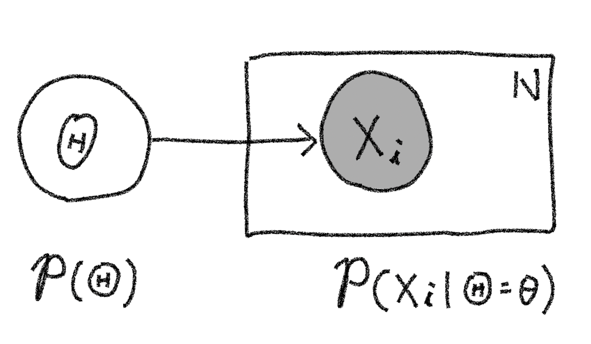
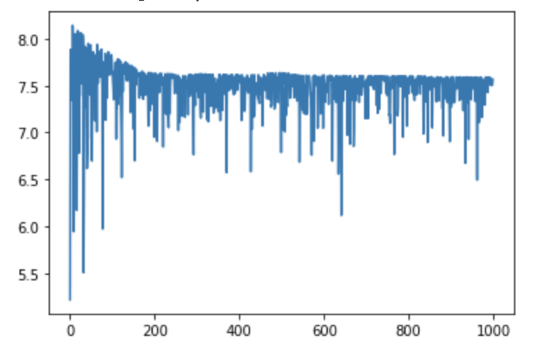
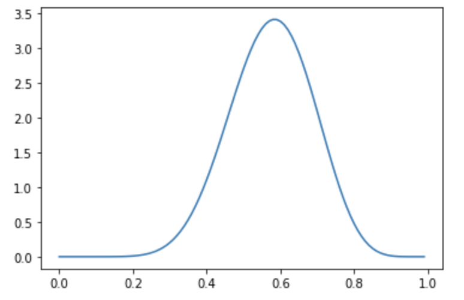
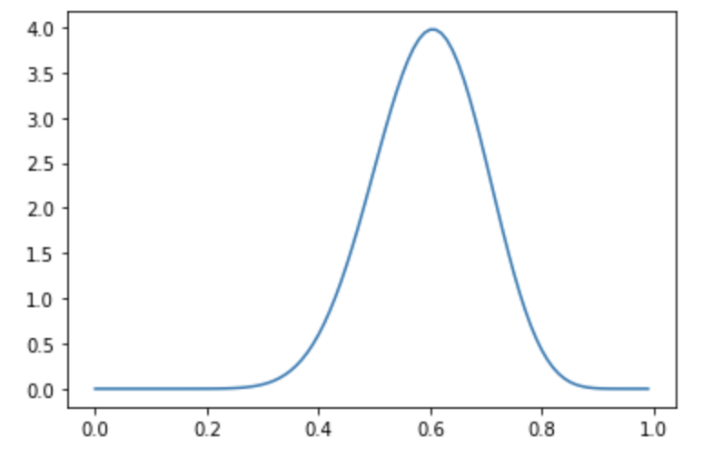

<script type="text/javascript" async src="https://cdnjs.cloudflare.com/ajax/libs/mathjax/2.7.7/MathJax.js?config=TeX-MML-AM_CHTML">
</script>
<script type="text/x-mathjax-config">
 MathJax.Hub.Config({
 tex2jax: {
 inlineMath: [['$', '$'] ],
 displayMath: [ ['$$','$$'], ["\\[","\\]"] ]
 }
 });
</script>

# 変分推論を試す
前節で変分近似は、
1. 対象の事象の発生過程を確率モデルとしてモデリングする。
2. 推定したいパラメータが従う事後確率分布の近似関数（変分関数）を仮定する。
3. 変分関数と真の事後関数のKLダイバージェンスを最小化する（＝ELBOを最大化する）。

という手順で行うことを説明しました。この節ではPyroを用いて変分推論を具体的に行っていく手順を見ていきます。Pyroでも上の手順をたどっていくことになります。以下の簡単な例を用いてその手順を１つずつ見ていくことにします。

**例：袋の中のボールの比率の推論**

赤玉と白玉が入っている袋があり、その中に入っている赤玉と白玉の数の比率（以下、混合比率）はわかっていません。ここで袋の中からランダムに１つを取り出しそのボールの色を確認後、箱の中に戻すという操作を複数回行います。
この時、10回の試行で赤が7回、白が3回が出た場合、玉の混合比率の確率分布をPyroを用いて推論していくことにします。

## 試行データ
ここでまず上記例の試行結果のデータを作っておきます。
```python
# 試行データ作成
def create_data(red_num, white_num):
    red = torch.tensor(1.0)
    white = torch.tensor(0.0)
    data = []
    for _ in range(red_num):
        data.append(red)
    for _ in range(white_num):
        data.append(white)
    random.shuffle(data)
    data = torch.tensor(data)
    return data

data = create_data(7, 3)
```
## 確率モデルの構築
混合比率の推論に向けて、まず最初に今回の事象が発生する確率モデルを構築します。

$i$回目の試行で取り出される玉の色を表す確率変数を$X_i \in \lbrace\text{赤, 白}\rbrace$とします。例えば混合率（今回は赤玉の比率）を$\theta$とすると、$\theta$に応じて$X_i$の実現値が決まると考えられるでしょう。ベイズ機械学習ではこの混合比率$\theta$も確率的に決まる値であり確率変数$\Theta$の実現値と考えます。つまり取り出される玉の色は以下の過程で決まるとモデル化します。[^gene_model]
1. 混合率の実現値$\theta$が、事前確率分布$p(\Theta)$に従って決まる。
2. 混合率が$\theta$と決まった条件下で、$\theta$に応じて確率$p(X_i|\Theta=\theta)$で玉の色が決まる。

この確率モデルをグラフィカルモデルで記述すると以下の図のようになります。今回の試行は混合率が$\Theta=\theta$と決まった条件下で各試行間は独立の関係（条件付き独立）となっています。そこで「プレート表現」を使って$N$回の試行を１つにまとめて表現しています。また玉の色は観測されるもので事後確率を考える上での「条件」となるので変数Xに相当するノードが塗り潰されています[^graph]。

<center>

</center>

またこの時、試行回数$N$とした時の同時確率分布は以下のように書けます。ここで$x_i$は$i$回目での思考の玉の色の実現値を示しています。
$$p(\mathbf{X}=\mathbf{x}, \Theta=\theta)=\prod_{i=1}^{N} p(X_i=x_i|\Theta=\theta)~p(\Theta=\theta)$$

さて、上記ステップ2.の取り出される色の確率分布は比率$\theta$をパラメータとしたベルヌーイ分布と仮定するのが自然でしょう。つまり
$$p(X_i|\Theta=\theta)=\operatorname{Bern}(X_i, \theta)$$

と仮定します。
また今回の例の場合、袋の中の玉の比率に関しては0から1の値を取るということ以外は何の事前情報も持っていません。そのためここでは一様分布の形をとるベータ分布
$$p(\Theta)=\operatorname{Beta}(\Theta|\alpha = 1, \beta = 1)$$
と仮定します[^beta]。

この確率モデルをPyroで記述してみます。前節で述べたとおりPyroでは確率モデルを確率プリミティブを組み合わせた関数の形で記述します。今回のモデルは以下の様に実装することができます。
```python
def model(data):
    # 比率Thetaの事前確率分布は無情報、つまり一様分布と仮定する。
    alpha0 = torch.tensor(1.0)
    beta0 = torch.tensor(1.0)
    f = pyro.sample("Theta", dist.Beta(alpha0, beta0))

    # 観測データのプレート定義
    with pyro.plate('observation'):
      pyro.sample('X', dist.Bernoulli(f), obs=data)
```
Pyroでは条件付き独立な関係の確率変数を,グラフィカルモデルと同様に`plate`としてまとめる機能を持っており、8,9行目ではそれを利用してモデル化しているのに注意してください。

## 変分関数を仮定
今回、我々は玉を取り出した結果をもとに玉の混合比率の確率分布$p(\Theta|X)$を求めようとしています。変分近似ではこの未知の分布をなんらかパラメータを用いて簡単に記述できる分布（変分関数）を仮定してそのパラメータを推定するのでした。ここでは変分関数としてベルヌーイ分布の共役事前分布であるベータ分布を採用し、ベータ分布のパラメータ$\alpha, \beta$を推定する問題に帰着させます。

Pyroでは変分関数の定義もモデルの定義と同様に確率プリミティブを組み合わせた関数の形で記述します。Pyroではこの変分関数を定義する関数を`guide`と呼びます。
```python
def guide(data):
    alpha_q = pyro.param("alpha_q", torch.tensor(10.0),
                         constraint=constraints.positive)
    beta_q = pyro.param("beta_q", torch.tensor(10.0),
                        constraint=constraints.positive)
    pyro.sample("Theta", dist.Beta(alpha_q, beta_q))
```
`guide`を定義する際、以下の点に注意する必要があります。
* `guide`関数の引数は`model`関数を定義した際の引数と同一であること。
* 学習対象である変分パラメータ（ここでは$\alpha, \beta$）を`pyro.param`を用いて定義します。これは後にELBOの各パラメータの偏微分値を求めるために、`requires_grad`フラグを`True`にセットした`torch.tensor`型の変数として各変分パラメータを定義していることに相当します。

またここではベータ分布において$\alpha, \beta$は正の値のため`constraint=constraints.positive`として最適化過程で取りえる値に制約を加えています。

## 最適化
変分関数が定義できたので、その中で変分パラメータとして定義した`alpha_q`と`alpha_q`をELBOが最大化するように最適化計算を行います。具体的には以下のコードのように実装します。

```python
# グローバル変数として保存されているパラメータを削除
pyro.clear_param_store()

# Optimizerの定義と設定（Adamの利用が推奨されている）
adam_params = {"lr": 0.005, "betas": (0.95, 0.999)}
optimizer = Adam(adam_params)

# 推論アルゴリズムとLoss値を定義
# ここでは組み込みのELBOの符号反転をLoss値とする`Trace_ELBO()`を利用しています。
svi = SVI(model, guide, optimizer, loss=Trace_ELBO())

# 最適化の逐次計算
# ここではAdamで勾配降下を5000回繰り返すことになる。
n_steps = 5000
losses = []
for step in range(n_steps):
    loss = svi.step(data)
    losses.append(loss)
    if step % 100 == 0:
        print('#', end='')

plt.plot(losses)
```
ここで、最適化を行う前に、`pyro.clear_param_store()`を実行しています。これはPyroではグローバル変数として各変分パラメータを保持しているため、それを消す処理を行っています。
またこのコードでは、`svi.step()`はLoss値（ELBOの符号逆転値）が返却されるので、Lossの変化をプロットしています。結果は以下の図のようになります。SVI(Stochastic Variational Inference)は確率的勾配降下法と同様にミニバッチで勾配計算を行うためロスがランダムに振動していますが、5000回イタレーションを繰り返すと、ELBOが小さいところで落ち着いているのが見てとれます。

<center>

</center>

この最適化後の変分パラメータは以下のコードで取得できます。
```python
# 最適化後の変分パラメータを取得する
alpha_q = pyro.param("alpha_q").item()
beta_q = pyro.param("beta_q").item()
print("alpha_q = {:.2f}, beta_q = {:.2f}".format(alpha_q, beta_q))
```
我々は混合分布の事後確率分布をベータ分布と仮定していましたから、上記のパラメータを用いて事後確率分布の様子をプロットして確認してみましょう。
```python
# 得られたパラメータを用いて事後確率分布をプロット
x_range = np.arange(0.0, 1.0, 0.01)
estimated_dist = dist.Beta(alpha_q, beta_q)
y = [estimated_dist.log_prob(torch.tensor([x])).exp() for x in x_range]
plt.plot(x_range, y)
```
得られるグラフは下図のようになります。事後分布$p(\Theta|X)$は0.7付近が最も大きくなっており、これは10回の試行で赤が7回出た観測事象と辻褄が合っているのがわかります。ただし10回の観測ではまだ混合比率に曖昧性があり、確率分布の裾野が比較的広い確率分布となります。

<center>

</center>

さらに観測回数を増やして100回の試行でそのうち赤が70回、白が30回取り出された場合はどのような混合比率の事後分布になるでしょうか？
試行データ作成時に`data = create_data(70, 30)`としてデータを作成して同様の推論を行ってみます。
すると結果の事後分布は下記のような形となり、10回の時よりも混合比率が0.7である確信が強まり、確率分布の裾野が10回の思考の場合よりも狭まっているのがわかります。

<center>

</center>


同時確率

[^graph]: グラフィカルモデルの詳細は例えば[このレビュー論文](https://projecteuclid.org/journals/statistical-science/volume-19/issue-1/Graphical-Models/10.1214/088342304000000026.full)でわかりやすく解説されているので参照してください。
[^gene_model]:この様に観測事象の生成過程を仮定してモデリングする確率過程を**生成モデル**と呼びます。
[^beta]:ここで事前分布としてベータ関数を採用のは単に確率変数の定義域が0~1かつ一様分布の確率分布を採用したいという動機であり、後のステップで変分関数としてベータ関数を採用するのとは無関係であることに注意してください。